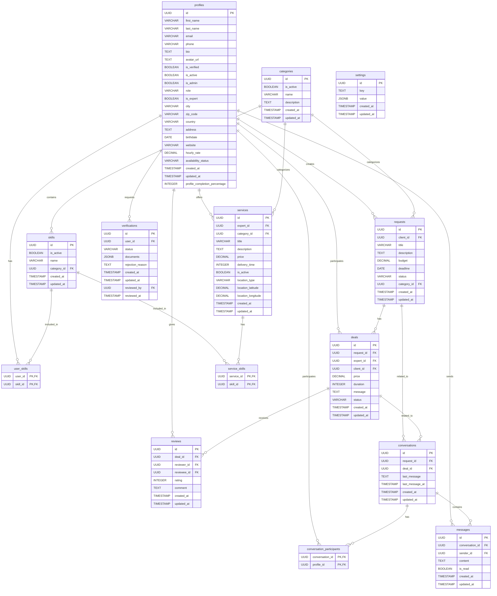

# Diagramme Entité-Relation de la Base de Données Havoo-UI

Ce document présente le diagramme entité-relation (ERD) du schéma de base de données Havoo-UI en utilisant la syntaxe Mermaid.

## Diagramme

## Notes sur le Diagramme

1. **Relations principales** :
   - Les profils utilisateurs (`profiles`) sont au centre du modèle et reliés à plusieurs autres entités
   - Les catégories (`categories`) contiennent des compétences (`skills`)
   - Les demandes (`requests`) et les contrats (`deals`) sont liés pour le flux de travail principal
   - Les conversations (`conversations`) peuvent être associées à des demandes ou des contrats

2. **Tables de jonction** :
   - `user_skills` : Associe les utilisateurs à leurs compétences
   - `service_skills` : Associe les services aux compétences requises
   - `conversation_participants` : Associe les utilisateurs aux conversations

3. **Clés étrangères** :
   - Les flèches indiquent les références de clés étrangères
   - Toutes les clés primaires sont des UUID pour la sécurité et l'évolutivité

4. **Notes sur la cardinalité** :
   - `||--o{` : Relation un-à-plusieurs (par exemple, un profil peut avoir plusieurs compétences)
   - Les contraintes d'intégrité référentielle sont appliquées via les clés étrangères

Ce diagramme ERD peut être visualisé en utilisant n'importe quel interpréteur Mermaid, comme l'extension Markdown Preview Enhanced dans VS Code ou des outils en ligne comme Mermaid Live Editor. 